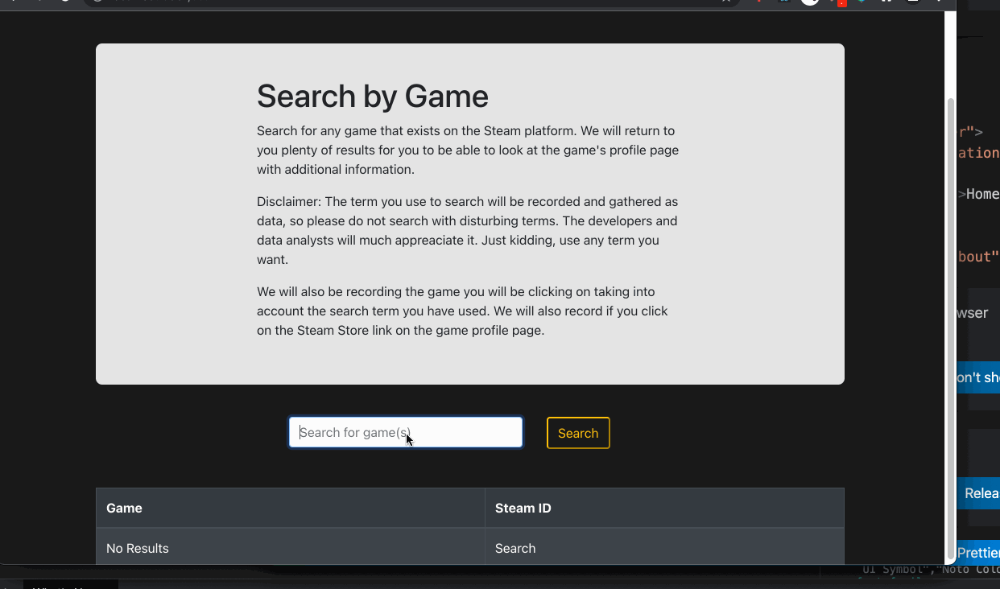
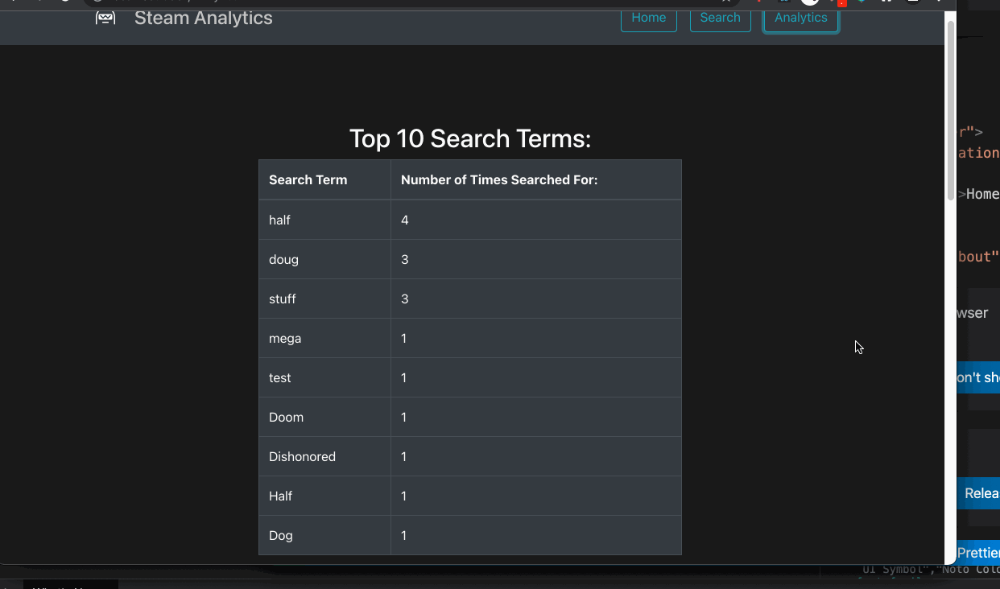

# Booming Barometer

## A User Focused Search Analytics app

## Project Summary:
A full PERN stack Steam search application that returns games, game information information, and Steam store checkout pages with each search. Also records search behavior and games clicks and uses the information to display constantly updated analytics.

## Technology Used:
### Front-End:
React
React Bootstrap

### Back-End:
PostgreSQL
Sequelize
Express
Heroku

## Search Behavior:

## Analytics Layout:

## Weblink:
[Heroku Link](https://lf-steam-search.herokuapp.com/)